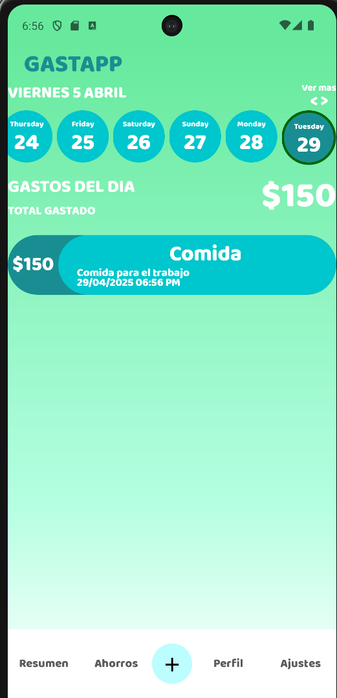

# 💸 Gastapp

**Gastapp** es una aplicación multiplataforma desarrollada en .NET MAUI para llevar el control de tus gastos personales de forma sencilla y efectiva. Los datos se almacenan localmente en el dispositivo, y se sincronizan con la nube al iniciar sesión, asegurando que tu información esté siempre respaldada y disponible.

---

## 🚀 Características

- Registro de gastos con categorías personalizables
- Visualización de resumen diario, quincenal o mensual
- Almacenamiento local seguro y rápido (SQLite) 
- Sincronización automática con la nube al iniciar sesión (API en desarrollo)
- Interfaz simple, responsiva y multiplataforma

---

## 🛠️ Tecnologías

- [.NET MAUI](https://learn.microsoft.com/en-us/dotnet/maui/) – Framework para apps multiplataforma
- SQLite – Base de datos local
- MVVM Toolkit – Arquitectura desacoplada y reactiva
- C# – Lenguaje principal
- API REST (Planeada en .NET Core)

---

## 🌐 Sincronización en la nube

Cuando el usuario inicia sesión, la app sincronizará automáticamente los datos locales con una **API REST** que se desarrollará próximamente en **.NET Core**. Esta funcionalidad permitirá:

- Respaldar los datos en servidores seguros
- Acceder a tus gastos desde distintos dispositivos
- Preparar el camino para futuras funciones colaborativas o multiusuario

---
### 📊 Resumen de gastos


## 📦 Instalación y ejecución

> ⚠️ Requiere .NET 8 SDK y Visual Studio 2022 o superior con el workload de MAUI instalado

```bash
git clone https://github.com/ELCesarMaat/App-Gastapp.git
cd gastapp
dotnet build
dotnet maui run
